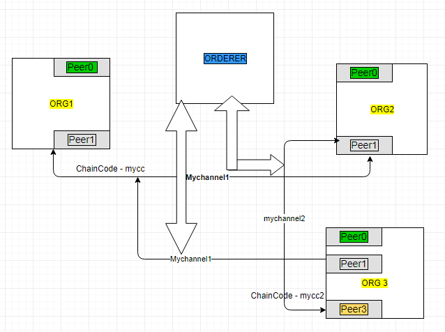

# Fabric-Samples-Explained

# For Learning Basic Hyperlerger fabric and how it functions.

Audience:  Newcommers - To learn Hyplerledger fabric with default samples. forked from fabric-sample 1.4.3

Forked from [Fabric-samples](https://github.com/hyperledger/fabric-samples) first-network
Ensure all prerequesties are completed, if not refer this [Download_script](https://github.com/ravinayag/Hyperledger/blob/master/download_hlf.sh) 
and [prereq_script](https://github.com/ravinayag/Hyperledger/blob/master/prereqs_hlfv14.sh)

Here is the Network Diagram for the fabric 

####  1, Create folder name called newnet under fabric-samples folder and move as your working dir.

#### 2, Copy files from first-network as below
```
~newnet$ mkdir  channel-artifacts base scripts && cp -r ../first-network/configtx.yaml, ../first-network/crypto-config.yaml, ../first-netwotk/dockercompose.cli.yaml base/*  .

set bin path 
export PATH=${PWD}/../bin:${PWD}:$PATH
export FABRIC_CFG_PATH=${PWD}

```

## Stage -1 
#### 3, Now set the environment variables by running script which generates genisis block and run the docker contiainer

```
 $ . ./scripts/basicenv.sh
```
OR 
```
export SYS_CHANNEL=syschannel
export CHANNEL_NAME=mychannel2
export IMAGE_TAG=latest
export COMPOSE_PROJECT_NAME=newnet

### Generate artifacts
cryptogen generate --config=./crypto-config.yaml

### Create Sys channel for genesis block
configtxgen -profile TwoOrgsOrdererGenesis -channelID $SYS_CHANNEL -outputBlock ./channel-artifacts/genesis.block
```

####  3.a,  Run the docker-compose file to run the network containers.
```
$ docker-compose -f docker-compose-cli.yaml up -d
$ docker ps -a   ## this will show you all  6 containers up and running. ( orderer, 2 peers on each org's (2 org) and cli)
```

#### 4, Run the script to create channel and receive first block, should not run this script second time. 
```
  $ ./scripts/create_anchr_channeltx.sh

OR 

$ configtxgen -profile TwoOrgsChannel -outputCreateChannelTx ./channel-artifacts/channel.tx -channelID $CHANNEL_NAME
$ configtxgen -profile TwoOrgsChannel -outputAnchorPeersUpdate ./channel-artifacts/Org1MSPanchors.tx -channelID $CHANNEL_NAME -asOrg Org1MSP
$ configtxgen -profile TwoOrgsChannel -outputAnchorPeersUpdate ./channel-artifacts/Org2MSPanchors.tx -channelID $CHANNEL_NAME -asOrg Org2MSP
```
####### Create Channel for peer communication
```
$ export ORDERER_CA=/opt/gopath/src/github.com/hyperledger/fabric/peer/crypto/ordererOrganizations/example.com/orderers/orderer.example.com/msp/tlscacerts/tlsca.example.com-cert.pem
$ docker exec cli peer channel create -o orderer.example.com:7050 -c $CHANNEL_NAME -f ./channel-artifacts/channel.tx --tls $CORE_PEER_TLS_ENABLED --cafile $ORDERER_CA
```

#### 5, Create a channel block and join the peers to the channel one by one 

```


######### First peer of Org1 ########


newnet $ docker exec cli sh ./scripts/joinpeer0.org1.sh

OR 

$ docker exec -it cli bash   ### you get the root prompt for  cli contianer and execute all commands from here.

set -x
CORE_PEER_TLS_ROOTCERT_FILE=/opt/gopath/src/github.com/hyperledger/fabric/peer/crypto/peerOrganizations/org1.example.com/peers/peer0.org1.example.com/tls/ca.crt
CORE_PEER_TLS_KEY_FILE=/opt/gopath/src/github.com/hyperledger/fabric/peer/crypto/peerOrganizations/org1.example.com/peers/peer0.org1.example.com/tls/server.key
CORE_PEER_LOCALMSPID=Org1MSP
CORE_VM_ENDPOINT=unix:///host/var/run/docker.sock
CORE_PEER_TLS_CERT_FILE=/opt/gopath/src/github.com/hyperledger/fabric/peer/crypto/peerOrganizations/org1.example.com/peers/peer0.org1.example.com/tls/server.crt
CORE_PEER_TLS_ENABLED=true
CORE_PEER_MSPCONFIGPATH=/opt/gopath/src/github.com/hyperledger/fabric/peer/crypto/peerOrganizations/org1.example.com/users/Admin@org1.example.com/msp
CORE_PEER_ID=cli
CORE_PEER_ADDRESS=peer0.org1.example.com:7051
CHANNEL_NAME=mychannel2
peer channel join -b $CHANNEL_NAME.block
```

######### Second peer of Org1 ########
```
newnet$ docker exec cli sh ./scripts/joinpeer1.org1.sh

OR 


$ docker exec -it cli bash   ### you get the root prompt for contianer
set -x
CORE_PEER_TLS_ROOTCERT_FILE=/opt/gopath/src/github.com/hyperledger/fabric/peer/crypto/peerOrganizations/org1.example.com/peers/peer0.org1.example.com/tls/ca.crt
CORE_PEER_TLS_KEY_FILE=/opt/gopath/src/github.com/hyperledger/fabric/peer/crypto/peerOrganizations/org1.example.com/peers/peer0.org1.example.com/tls/server.key
CORE_PEER_LOCALMSPID=Org1MSP
CORE_VM_ENDPOINT=unix:///host/var/run/docker.sock
CORE_PEER_TLS_CERT_FILE=/opt/gopath/src/github.com/hyperledger/fabric/peer/crypto/peerOrganizations/org1.example.com/peers/peer0.org1.example.com/tls/server.crt
CORE_PEER_TLS_ENABLED=true
CORE_PEER_MSPCONFIGPATH=/opt/gopath/src/github.com/hyperledger/fabric/peer/crypto/peerOrganizations/org1.example.com/users/Admin@org1.example.com/msp
CORE_PEER_ID=cli
CORE_PEER_ADDRESS=peer1.org1.example.com:8051
CHANNEL_NAME=mychannel2
peer channel join -b $CHANNEL_NAME.block
```
######### First peer of Org2 ##########
```
$ docker exec cli sh ./scripts/joinpeer0.org2.sh

OR

set -x
CORE_PEER_TLS_ROOTCERT_FILE=/opt/gopath/src/github.com/hyperledger/fabric/peer/crypto/peerOrganizations/org2.example.com/peers/peer0.org2.example.com/tls/ca.crt
CORE_PEER_TLS_KEY_FILE=/opt/gopath/src/github.com/hyperledger/fabric/peer/crypto/peerOrganizations/org1.example.com/peers/peer0.org1.example.com/tls/server.key
CORE_PEER_LOCALMSPID=Org2MSP
CORE_VM_ENDPOINT=unix:///host/var/run/docker.sock
CORE_PEER_TLS_CERT_FILE=/opt/gopath/src/github.com/hyperledger/fabric/peer/crypto/peerOrganizations/org1.example.com/peers/peer0.org1.example.com/tls/server.crt
CORE_PEER_TLS_ENABLED=true
CORE_PEER_MSPCONFIGPATH=/opt/gopath/src/github.com/hyperledger/fabric/peer/crypto/peerOrganizations/org2.example.com/users/Admin@org2.example.com/msp
CORE_PEER_ID=cli
CORE_PEER_ADDRESS=peer0.org2.example.com:9051
CHANNEL_NAME=mychannel2
peer channel join -b $CHANNEL_NAME.block
```
######### Second peer of Org2 ##########
```
$ docker exec cli sh ./scripts/joinpeer1.org2.sh

OR

set -x
CORE_PEER_TLS_ROOTCERT_FILE=/opt/gopath/src/github.com/hyperledger/fabric/peer/crypto/peerOrganizations/org2.example.com/peers/peer0.org2.example.com/tls/ca.crt
CORE_PEER_TLS_KEY_FILE=/opt/gopath/src/github.com/hyperledger/fabric/peer/crypto/peerOrganizations/org1.example.com/peers/peer0.org1.example.com/tls/server.key
CORE_PEER_LOCALMSPID=Org2MSP
CORE_VM_ENDPOINT=unix:///host/var/run/docker.sock
CORE_PEER_TLS_CERT_FILE=/opt/gopath/src/github.com/hyperledger/fabric/peer/crypto/peerOrganizations/org1.example.com/peers/peer0.org1.example.com/tls/server.crt
CORE_PEER_TLS_ENABLED=true
CORE_PEER_MSPCONFIGPATH=/opt/gopath/src/github.com/hyperledger/fabric/peer/crypto/peerOrganizations/org2.example.com/users/Admin@org2.example.com/msp
CORE_PEER_ID=cli
CORE_PEER_ADDRESS=peer1.org2.example.com:10051
CHANNEL_NAME=mychannel2
peer channel join -b $CHANNEL_NAME.block
```
####  6, Update anchor PEER channel for orgs
```
$ docker exec cli sh ./scripts/ancpeer0org1join.sh

OR 

$ docker exec -it cli bash   ### you get the root prompt for contianer
set -x
CORE_PEER_TLS_ROOTCERT_FILE=/opt/gopath/src/github.com/hyperledger/fabric/peer/crypto/peerOrganizations/org1.example.com/peers/peer0.org1.example.com/tls/ca.crt
CORE_PEER_TLS_KEY_FILE=/opt/gopath/src/github.com/hyperledger/fabric/peer/crypto/peerOrganizations/org1.example.com/peers/peer0.org1.example.com/tls/server.key
CORE_PEER_LOCALMSPID=Org1MSP
CORE_VM_ENDPOINT=unix:///host/var/run/docker.sock
CORE_PEER_TLS_CERT_FILE=/opt/gopath/src/github.com/hyperledger/fabric/peer/crypto/peerOrganizations/org1.example.com/peers/peer0.org1.example.com/tls/server.crt
CORE_PEER_TLS_ENABLED=true
CORE_PEER_MSPCONFIGPATH=/opt/gopath/src/github.com/hyperledger/fabric/peer/crypto/peerOrganizations/org1.example.com/users/Admin@org1.example.com/msp
CORE_PEER_ID=cli
CORE_PEER_ADDRESS=peer0.org1.example.com:7051
ORDERER_CA=/opt/gopath/src/github.com/hyperledger/fabric/peer/crypto/ordererOrganizations/example.com/orderers/orderer.example.com/msp/tlscacerts/tlsca.example.com-cert.pem
peer channel update -o orderer.example.com:7050 -c $CHANNEL_NAME -f ./channel-artifacts/Org1MSPanchors.tx --tls $CORE_PEER_TLS_ENABLED --cafile $ORDERER_CA
```

######### Repeat same from the second org - Org2 ##########
```
set -x
CORE_PEER_TLS_ROOTCERT_FILE=/opt/gopath/src/github.com/hyperledger/fabric/peer/crypto/peerOrganizations/org2.example.com/peers/peer0.org2.example.com/tls/ca.crt
CORE_PEER_TLS_KEY_FILE=/opt/gopath/src/github.com/hyperledger/fabric/peer/crypto/peerOrganizations/org1.example.com/peers/peer0.org1.example.com/tls/server.key
CORE_PEER_LOCALMSPID=Org2MSP
CORE_VM_ENDPOINT=unix:///host/var/run/docker.sock
CORE_PEER_TLS_CERT_FILE=/opt/gopath/src/github.com/hyperledger/fabric/peer/crypto/peerOrganizations/org1.example.com/peers/peer0.org1.example.com/tls/server.crt
CORE_PEER_TLS_ENABLED=true
CORE_PEER_MSPCONFIGPATH=/opt/gopath/src/github.com/hyperledger/fabric/peer/crypto/peerOrganizations/org2.example.com/users/Admin@org2.example.com/msp
CORE_PEER_ID=cli
CORE_PEER_ADDRESS=peer0.org2.example.com:9051
ORDERER_CA=/opt/gopath/src/github.com/hyperledger/fabric/peer/crypto/ordererOrganizations/example.com/orderers/orderer.example.com/msp/tlscacerts/tlsca.example.com-cert.pem
CHANNEL_NAME=mychannel2
peer channel update -o orderer.example.com:7050 -c $CHANNEL_NAME -f ./channel-artifacts/Org2MSPanchors.tx --tls $CORE_PEER_TLS_ENABLED --cafile $ORDERER_CA
```


#### Now the Network is ready and docker Containers up and communicating with Channel  
############################################################################################
### Stage 2 
### Chaincode install/instantiate
Now your network is up and running,  you have to deploy chaincode/smartcontracts over the network
your network consists of one orderer and 4 peers ( 2 from each org.)
we have one cli container to execute our binaries.

Lets install the chaincode on peer0.org1 export the variables first.
```
newnet$ docker exec cli sh ./scripts/ccinsstallpeer0.org1.sh

OR

$ docker exec -it cli bash   ### you get the root prompt for contianer

export CORE_PEER_TLS_ROOTCERT_FILE=/opt/gopath/src/github.com/hyperledger/fabric/peer/crypto/peerOrganizations/org1.example.com/peers/peer0.org1.example.com/tls/ca.crt
export CORE_PEER_TLS_KEY_FILE=/opt/gopath/src/github.com/hyperledger/fabric/peer/crypto/peerOrganizations/org1.example.com/peers/peer0.org1.example.com/tls/server.key
export CORE_PEER_LOCALMSPID=Org1MSP
export CORE_VM_ENDPOINT=unix:///host/var/run/docker.sock
export CORE_PEER_TLS_CERT_FILE=/opt/gopath/src/github.com/hyperledger/fabric/peer/crypto/peerOrganizations/org1.example.com/peers/peer0.org1.example.com/tls/server.crt
export CORE_PEER_TLS_ENABLED=true
export CORE_PEER_MSPCONFIGPATH=/opt/gopath/src/github.com/hyperledger/fabric/peer/crypto/peerOrganizations/org1.example.com/users/Admin@org1.example.com/msp
export CORE_PEER_ID=cli
export CORE_PEER_ADDRESS=peer0.org1.example.com:7051
peer chaincode install -n mycc -v 1.0 -l golang -p github.com/chaincode/chaincode_example02/go/
```
Do this same for Org2
Install chaincode on peer0.org2...
```
export CORE_PEER_TLS_ROOTCERT_FILE=/opt/gopath/src/github.com/hyperledger/fabric/peer/crypto/peerOrganizations/org2.example.com/peers/peer0.org2.example.com/tls/ca.crt
export CORE_PEER_TLS_KEY_FILE=/opt/gopath/src/github.com/hyperledger/fabric/peer/crypto/peerOrganizations/org1.example.com/peers/peer0.org1.example.com/tls/server.key
export CORE_PEER_LOCALMSPID=Org2MSP
export CORE_VM_ENDPOINT=unix:///host/var/run/docker.sock
export CORE_PEER_TLS_CERT_FILE=/opt/gopath/src/github.com/hyperledger/fabric/peer/crypto/peerOrganizations/org1.example.com/peers/peer0.org1.example.com/tls/server.crt
export CORE_PEER_TLS_ENABLED=true
export CORE_PEER_MSPCONFIGPATH=/opt/gopath/src/github.com/hyperledger/fabric/peer/crypto/peerOrganizations/org2.example.com/users/Admin@org2.example.com/msp
export CORE_PEER_ID=cli
export CORE_PEER_ADDRESS=peer0.org2.example.com:9051
peer chaincode install -n mycc -v 1.0 -l golang -p github.com/chaincode/chaincode_example02/go/
```
Installing chaincode on peer1.org2...
```
export CORE_PEER_TLS_ROOTCERT_FILE=/opt/gopath/src/github.com/hyperledger/fabric/peer/crypto/peerOrganizations/org2.example.com/peers/peer0.org2.example.com/tls/ca.crt
export CORE_PEER_TLS_KEY_FILE=/opt/gopath/src/github.com/hyperledger/fabric/peer/crypto/peerOrganizations/org1.example.com/peers/peer0.org1.example.com/tls/server.key
export CORE_PEER_LOCALMSPID=Org2MSP
export CORE_VM_ENDPOINT=unix:///host/var/run/docker.sock
export CORE_PEER_TLS_CERT_FILE=/opt/gopath/src/github.com/hyperledger/fabric/peer/crypto/peerOrganizations/org1.example.com/peers/peer0.org1.example.com/tls/server.crt
export CORE_PEER_TLS_ENABLED=true
export CORE_PEER_MSPCONFIGPATH=/opt/gopath/src/github.com/hyperledger/fabric/peer/crypto/peerOrganizations/org2.example.com/users/Admin@org2.example.com/msp
export CORE_PEER_ID=cli
export CORE_PEER_ADDRESS=peer1.org2.example.com:10051
peer chaincode install -n mycc -v 1.0 -l golang -p github.com/chaincode/chaincode_example02/go/
```

Now lets instantiate the chaincode to the network

you can run the script or below with variables
```
export CORE_PEER_TLS_ROOTCERT_FILE=/opt/gopath/src/github.com/hyperledger/fabric/peer/crypto/peerOrganizations/org2.example.com/peers/peer0.org2.example.com/tls/ca.crt
export CORE_PEER_TLS_KEY_FILE=/opt/gopath/src/github.com/hyperledger/fabric/peer/crypto/peerOrganizations/org1.example.com/peers/peer0.org1.example.com/tls/server.key
export CORE_PEER_LOCALMSPID=Org2MSP
export CORE_VM_ENDPOINT=unix:///host/var/run/docker.sock
export CORE_PEER_TLS_CERT_FILE=/opt/gopath/src/github.com/hyperledger/fabric/peer/crypto/peerOrganizations/org1.example.com/peers/peer0.org1.example.com/tls/server.crt
export CORE_PEER_TLS_ENABLED=true
export CORE_PEER_MSPCONFIGPATH=/opt/gopath/src/github.com/hyperledger/fabric/peer/crypto/peerOrganizations/org2.example.com/users/Admin@org2.example.com/msp
export CORE_PEER_ID=cli
export CORE_PEER_ADDRESS=peer0.org2.example.com:9051
peer chaincode instantiate -o orderer.example.com:7050 --tls true --cafile /opt/gopath/src/github.com/hyperledger/fabric/peer/crypto/ordererOrganizations/example.com/orderers/orderer.example.com/msp/tlscacerts/tlsca.example.com-cert.pem -C mychannel2 -n mycc -l golang -v 1.0 -c '{"Args":["init","a","100","b","200"]}' -P 'AND ('\''Org1MSP.peer'\'','\''Org2MSP.peer'\'')'
```
After instantiate the chaincode, you can query the assets.you will get the value of "A" is 100. 


Querying chaincode on peer0.org1...
```
export CORE_PEER_TLS_ROOTCERT_FILE=/opt/gopath/src/github.com/hyperledger/fabric/peer/crypto/peerOrganizations/org1.example.com/peers/peer0.org1.example.com/tls/ca.crt
export CORE_PEER_TLS_KEY_FILE=/opt/gopath/src/github.com/hyperledger/fabric/peer/crypto/peerOrganizations/org1.example.com/peers/peer0.org1.example.com/tls/server.key
export CORE_PEER_LOCALMSPID=Org1MSP
export CORE_VM_ENDPOINT=unix:///host/var/run/docker.sock
export CORE_PEER_TLS_CERT_FILE=/opt/gopath/src/github.com/hyperledger/fabric/peer/crypto/peerOrganizations/org1.example.com/peers/peer0.org1.example.com/tls/server.crt
export CORE_PEER_TLS_ENABLED=true
export CORE_PEER_MSPCONFIGPATH=/opt/gopath/src/github.com/hyperledger/fabric/peer/crypto/peerOrganizations/org1.example.com/users/Admin@org1.example.com/msp
export CORE_PEER_ID=cli
export CORE_PEER_ADDRESS=peer0.org1.example.com:7051
peer chaincode query -C mychannel2 -n mycc -c '{"Args":["query","a"]}'
```
Lets invoke the transaction from "A" to "B"   and do query from pee1.org2 for transaction status


Sending invoke transaction on peer0.org1 peer0.org2...
```
export CORE_PEER_TLS_ROOTCERT_FILE=/opt/gopath/src/github.com/hyperledger/fabric/peer/crypto/peerOrganizations/org1.example.com/peers/peer0.org1.example.com/tls/ca.crt
export CORE_PEER_TLS_KEY_FILE=/opt/gopath/src/github.com/hyperledger/fabric/peer/crypto/peerOrganizations/org1.example.com/peers/peer0.org1.example.com/tls/server.key
export CORE_PEER_LOCALMSPID=Org1MSP
export CORE_VM_ENDPOINT=unix:///host/var/run/docker.sock
export CORE_PEER_TLS_CERT_FILE=/opt/gopath/src/github.com/hyperledger/fabric/peer/crypto/peerOrganizations/org1.example.com/peers/peer0.org1.example.com/tls/server.crt
export CORE_PEER_TLS_ENABLED=true
export CORE_PEER_MSPCONFIGPATH=/opt/gopath/src/github.com/hyperledger/fabric/peer/crypto/peerOrganizations/org1.example.com/users/Admin@org1.example.com/msp
export CORE_PEER_ID=cli
export CORE_PEER_ADDRESS=peer0.org1.example.com:7051
export CORE_PEER_TLS_ROOTCERT_FILE=/opt/gopath/src/github.com/hyperledger/fabric/peer/crypto/peerOrganizations/org2.example.com/peers/peer0.org2.example.com/tls/ca.crt
export CORE_PEER_TLS_KEY_FILE=/opt/gopath/src/github.com/hyperledger/fabric/peer/crypto/peerOrganizations/org1.example.com/peers/peer0.org1.example.com/tls/server.key
export CORE_PEER_LOCALMSPID=Org2MSP
export CORE_VM_ENDPOINT=unix:///host/var/run/docker.sock
export CORE_PEER_TLS_CERT_FILE=/opt/gopath/src/github.com/hyperledger/fabric/peer/crypto/peerOrganizations/org1.example.com/peers/peer0.org1.example.com/tls/server.crt
export CORE_PEER_TLS_ENABLED=true
export CORE_PEER_MSPCONFIGPATH=/opt/gopath/src/github.com/hyperledger/fabric/peer/crypto/peerOrganizations/org2.example.com/users/Admin@org2.example.com/msp
export CORE_PEER_ID=cli
export CORE_PEER_ADDRESS=peer0.org2.example.com:9051

export ORDERER_CA=/opt/gopath/src/github.com/hyperledger/fabric/peer/crypto/ordererOrganizations/example.com/orderers/orderer.example.com/msp/tlscacerts/tlsca.example.com-cert.pem
export PEER0_ORG1_CA=/opt/gopath/src/github.com/hyperledger/fabric/peer/crypto/peerOrganizations/org1.example.com/peers/peer0.org1.example.com/tls/ca.crt
export PEER0_ORG2_CA=/opt/gopath/src/github.com/hyperledger/fabric/peer/crypto/peerOrganizations/org2.example.com/peers/peer0.org2.example.com/tls/ca.crt

peer chaincode invoke -o orderer.example.com:7050 --tls true --cafile $ORDERER_CA  -C mychannel2 -n mycc --peerAddresses peer0.org1.example.com:7051 --tlsRootCertFiles $PEER0_ORG1_CA  --peerAddresses peer0.org2.example.com:9051 --tlsRootCertFiles $PEER0_ORG2_CA -c '{"Args":["invoke","a","b","10"]}'

 ```
Query from  Peer1.org2 and you should get value of "a" is 90.
 
Querying chaincode on peer1.org2...
```
export CORE_PEER_TLS_ROOTCERT_FILE=/opt/gopath/src/github.com/hyperledger/fabric/peer/crypto/peerOrganizations/org2.example.com/peers/peer0.org2.example.com/tls/ca.crt
export CORE_PEER_TLS_KEY_FILE=/opt/gopath/src/github.com/hyperledger/fabric/peer/crypto/peerOrganizations/org1.example.com/peers/peer0.org1.example.com/tls/server.key
export CORE_PEER_LOCALMSPID=Org2MSP
export CORE_VM_ENDPOINT=unix:///host/var/run/docker.sock
export CORE_PEER_TLS_CERT_FILE=/opt/gopath/src/github.com/hyperledger/fabric/peer/crypto/peerOrganizations/org1.example.com/peers/peer0.org1.example.com/tls/server.crt
export CORE_PEER_TLS_ENABLED=true
export CORE_PEER_MSPCONFIGPATH=/opt/gopath/src/github.com/hyperledger/fabric/peer/crypto/peerOrganizations/org2.example.com/users/Admin@org2.example.com/msp
export CORE_PEER_ID=cli
export CORE_PEER_ADDRESS=peer1.org2.example.com:10051
===================== Querying on peer1.org2 on channel 'mychannel2'... =====================
Attempting to Query peer1.org2 ...3 secs
peer chaincode query -C mychannel2 -n mycc -c '{"Args":["query","a"]}'
```


## Stage - 3 
## Now add the new organizations (org3) to exsisting network


Copy files from first-network folder

#### 1, Directory  of org3-artifacts and file docker-compose-org3.yaml	
```
newnet$ cp -r ../first-network/org3-artifacts .  && cp ../first-network/docker-compose-org3.yaml .
```
Change dir to /home/ubuntu/fabric-samples/newnet/org3-artifacts

#### 2,  Doing pre requesties
```
 export PATH=${PWD}/../bin:${PWD}:$PATH
 export FABRIC_CFG_PATH=${PWD}

$ cryptogen generate --config=./org3-crypto.yaml
$ export FABRIC_CFG_PATH=$PWD && ../../bin/configtxgen -printOrg Org3MSP > ../channel-artifacts/org3.json
$ cd ../ && cp -r crypto-config/ordererOrganizations org3-artifacts/crypto-config/
$ sudo apt-get -y update && sudo apt-get -y install jq 
```
#### 3,  Gathering the Channel configurations and updating with new org to existing channel
```
$ docker exec -it cli bash

## Update the environment settings
$ export ORDERER_CA=/opt/gopath/src/github.com/hyperledger/fabric/peer/crypto/ordererOrganizations/example.com/orderers/orderer.example.com/msp/tlscacerts/tlsca.example.com-cert.pem
$ export CHANNEL_NAME=mychannel2
$ peer channel fetch config config_block.pb -o orderer.example.com:7050 -c $CHANNEL_NAME --tls --cafile $ORDERER_CA

##Convert the Configuration to JSON  and add the new org 
$ configtxlator proto_decode --input config_block.pb --type common.Block | jq .data.data[0].payload.data.config > config.json
$ jq -s '.[0] * {"channel_group":{"groups":{"Application":{"groups": {"Org3MSP":.[1]}}}}}' config.json ./channel-artifacts/org3.json > modified_config.json

## Translate config.json back into a protobuf  and Encode modified_config.json to modified_config.pb
$ configtxlator proto_encode --input config.json --type common.Config --output config.pb
$ configtxlator proto_encode --input modified_config.json --type common.Config --output modified_config.pb

## Identify the difference  between  protobuf and decode to readable json format.
$ configtxlator compute_update --channel_id $CHANNEL_NAME --original config.pb --updated modified_config.pb --output org3_update.pb
$ configtxlator proto_decode --input org3_update.pb --type common.ConfigUpdate | jq . > org3_update.json

## Wrap in an envelope message and encode to protobuf
$ echo '{"payload":{"header":{"channel_header":{"channel_id":"mychannel2", "type":2}},"data":{"config_update":'$(cat org3_update.json)'}}}' | jq . > org3_update_in_envelope.json
$ configtxlator proto_encode --input org3_update_in_envelope.json --type common.Envelope --output org3_update_in_envelope.pb

##sign and submit the config updates from the org1 and org2 
$ peer channel signconfigtx -f org3_update_in_envelope.pb   ### org1 signoff for adding org3

## Export the environment variables to sign as org2 
export CORE_PEER_LOCALMSPID="Org2MSP"
export CORE_PEER_TLS_ROOTCERT_FILE=/opt/gopath/src/github.com/hyperledger/fabric/peer/crypto/peerOrganizations/org2.example.com/peers/peer0.org2.example.com/tls/ca.crt
export CORE_PEER_MSPCONFIGPATH=/opt/gopath/src/github.com/hyperledger/fabric/peer/crypto/peerOrganizations/org2.example.com/users/Admin@org2.example.com/msp
export CORE_PEER_ADDRESS=peer0.org2.example.com:9051
peer channel update -f org3_update_in_envelope.pb -c $CHANNEL_NAME -o orderer.example.com:7050 --tls --cafile $ORDERER_CA
```

#### 4, Do org3 container up. and get into org3cli
```
$ docker-compose -f docker-compose-org3.yaml up -d
$ docker exec -it Org3cli bash

##export variables and join the channel
$ export ORDERER_CA=/opt/gopath/src/github.com/hyperledger/fabric/peer/crypto/ordererOrganizations/example.com/orderers/orderer.example.com/msp/tlscacerts/tlsca.example.com-cert.pem 
$ export CHANNEL_NAME=mychannel2
$ peer channel fetch 0 mychannel2.block -o orderer.example.com:7050 -c $CHANNEL_NAME --tls --cafile $ORDERER_CA
$ peer channel join -b mychannel2.block
```
##### 4.a  Do this for second peer1.org3 ( this is optional for demo requirement)
```
$ export CORE_PEER_TLS_ROOTCERT_FILE=/opt/gopath/src/github.com/hyperledger/fabric/peer/crypto/peerOrganizations/org3.example.com/peers/peer1.org3.example.com/tls/ca.crt 
$ export CORE_PEER_ADDRESS=peer1.org3.example.com:12051
$ peer channel join -b mychannel2.block

#### 5, Install Chaincode. 
##comeback to peer0.org3 and install chaincode
$ export CORE_PEER_TLS_ROOTCERT_FILE=/opt/gopath/src/github.com/hyperledger/fabric/peer/crypto/peerOrganizations/org3.example.com/peers/peer0.org3.example.com/tls/ca.crt 
export CORE_PEER_ADDRESS=peer0.org3.example.com:11051
peer chaincode install -n mycc -v 1.0 -l golang -p github.com/chaincode/chaincode_example02/go/

## Query from org3 node for the assets Do this step after chaincode has instantiated from Org2.
peer chaincode query -C mychannel2 -n mycc -c '{"Args":["query","a"]}'

```


#########################################################################################
#########################################################################################
